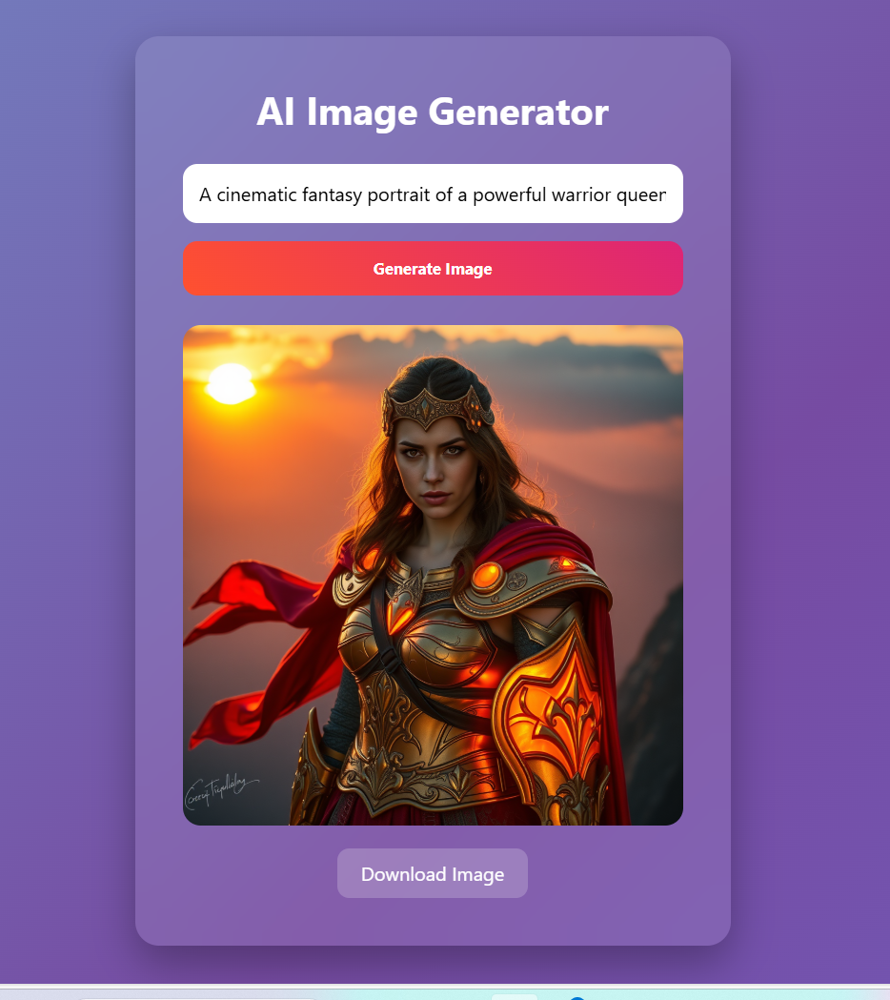

# AI-Image-Generator

## Overview

The AI Image Generator is a web application that allows users to generate images based on text prompts using the Hugging Face Inference API. Users can enter their prompts, view the generated images, and download them directly from the application.

The application features a clean, modern user interface with smooth animations for an enhanced user experience.

--------------------------------------------------------------------------------------------------------------------------------------------------------------------------------------------------------

## Features

- Text-to-Image Generation: Generates AI-powered images based on user-provided prompts.
- Fast API Integration: Integrated with the Hugging Face Inference API.
- Image Download: Option to download the generated image.
- Dynamic Background Animation: Gradient animations for improved user experience.
- Responsive UI: Works across different screen sizes.
- Secure API Handling: API keys managed securely using environment variables.

--------------------------------------------------------------------------------------------------------------------------------------------------------------------------------------------------------

## Tech Stack

- Backend: Flask (Python)
- Frontend: HTML, CSS, JavaScript
- API Integration: Hugging Face Inference API

--------------------------------------------------------------------------------------------------------------------------------------------------------------------------------------------------------

## Prerequisites

Before you begin, ensure you have the following:

- Python 3.7 or later installed
- pip installed
- Hugging Face API token
- Required dependencies (listed in requirements.txt)


--------------------------------------------------------------------------------------------------------------------------------------------------------------------------------------------------------

## Installation

### 1. Clone the Repository

```bash
git clone https://github.com/Sathvika-vaidyula/ai_img_convertor.git
cd ai_img_convertor
```

### 2. Create a Virtual Environment (Recommended)

```bash
python -m venv venv
```

Activate the environment:

**Windows**
```bash
venv\Scripts\activate
```

**Mac/Linux**
```bash
source venv/bin/activate
```

### 3. Install Dependencies

```bash
pip install -r requirements.txt
```

--------------------------------------------------------------------------------------------------------------------------------------------------------------------------------------------------------

## Configuration

Create a `.env` file in the root directory and add your Hugging Face API token:

```
HF_TOKEN=your_huggingface_api_token_here
```

Do not hardcode your API key in `app.py`. The application securely loads the token using environment variables.

----------------------------------------------------------------------------------------------------------------------------------------------------------------------------------------------------

## Running the Application

Start the Flask development server:

```bash
python app.py
```

Open your browser and navigate to:

```
http://127.0.0.1:5000
```

Enter a prompt and generate AI images instantly.

--------------------------------------------------------------------------------------------------------------------------------------------------------------------------------------------------------

## Project Structure

```
ai-image-generator/
│
├── static/
│   ├── styles.css
│   └── screenshot.png
│
├── templates/
│   └── index.html
│
├── app.py
├── requirements.txt
├── .gitignore
└── README.md
```

--------------------------------------------------------------------------------------------------------------------------------------------------------------------------------------------------------

## Screenshot Preview

<p align="center">
  
</p>

--------------------------------------------------------------------------------------------------------------------------------------------------------------------------------------------------------

## Contributing

Contributions are welcome.

1. Fork the repository  
2. Create a new branch:
   ```bash
   git checkout -b feature-name
   ```
3. Commit your changes:
   ```bash
   git commit -m "Add feature-name"
   ```
4. Push to your branch:
   ```bash
   git push origin feature-name
   ```
5. Create a Pull Request  

--------------------------------------------------------------------------------------------------------------------------------------------------------------------------------------------------------

## License

This project is licensed under the MIT License.

--------------------------------------------------------------------------------------------------------------------------------------------------------------------------------------------------------

## Author

Sathvika Vaidyula  
GitHub: https://github.com/Sathvika-vaidyula
